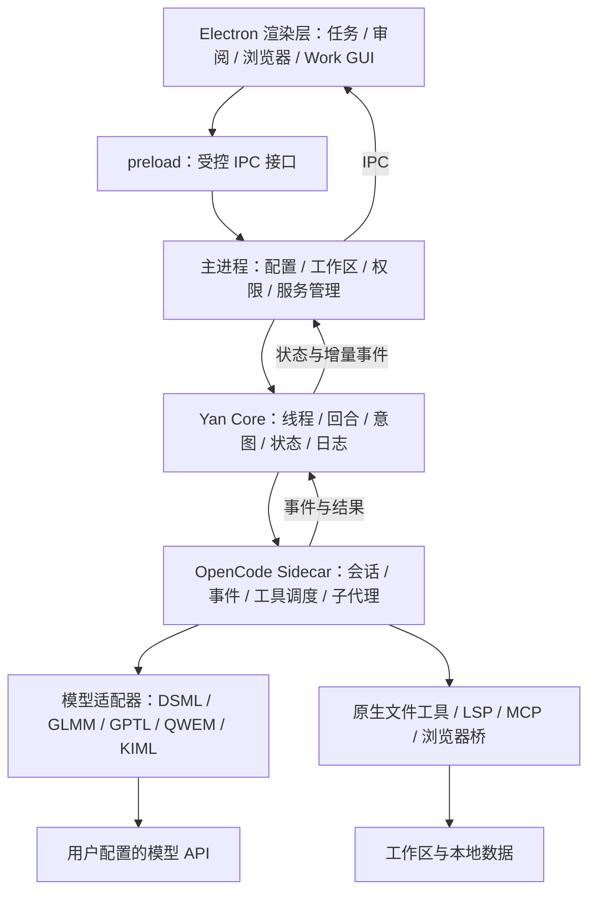

# YAgent 技术参考

[返回项目首页](https://github.com/ViaTumLab/Yan-Agent)

[ViaTum Lab 公司网站](https://viatumlab.com) · [YAgent 产品介绍](https://viatumlab.com/product-intro.html)

面向真实工作区的 Windows 桌面 Agent。连接你选择的模型，让它读取项目、定位代码、使用工具、协作修改、操作内置浏览器，并把执行过程与文件变化交付给你审阅。


**模型负责推理与生成，Yan 负责提供可用的工程环境。** 项目理解、精确编辑、状态持久化、权限、上下文、MCP、子代理与审阅是产品的一部分，不需要用户把每项能力重新拼装成独立工具。

本文对应 `package.json` 的 **1.6.0**。1.6.0 的核心变化是专用模型适配、工程分析工具、长任务恢复、结构化子代理协作、审阅性能、网页注释，以及云顶天宫 Work GUI。产品介绍见 [YAgent 产品页](https://viatumlab.com/product-intro.html)。

> 当前为 v1.6.0 正式版。本文解释已经存在的代码及其边界，不把实验模块、工具可用性或测试文件数量等同于任务成功率。模型服务的可用性、价格、额度和参数支持以实际供应商为准。

<a id="contents"></a>
## 阅读导航

- [开始使用](#start)
- [整体架构与一次任务的生命周期](#architecture)
- [模型协议与专用适配器](#providers)
- [大型项目理解与精确代码操作](#coding)
- [八类子代理与委派计划](#subagents)
- [长任务、流式输出与恢复](#recovery)
- [上下文预算与压缩](#context)
- [Git、worktree 与 PR](#git)
- [审阅系统](#review)
- [内置浏览器与网页注释](#browser)
- [工作模式、自进化与 AGI](#modes)
- [Skills、MCP 与多模态](#extensions)
- [云顶天宫 Work GUI](#palace)
- [桌面交互与阅读体验](#desktop)
- [权限、数据与凭据](#data)
- [开发、构建与测试](#development)
- [边界、排查与版本迁移](#limits)
- [代码地图与开源致谢](#sources)

<a id="start"></a>
## 开始使用

### 安装与首次配置

在 [Releases](https://github.com/ViaTumLab/Yan-Agent/releases) 中选择实际已发布的 Windows x64 安装包或便携包。README 的开发版本号不代表对应发布资产一定已经上传。

1. 打开 API 配置，创建一个连接，填写名称、Base URL 和 API Key。
2. 选择兼容预设和服务端实际支持的格式，测试连接；模型可从返回列表选择，也可以手填模型 ID。
3. 选择主文本模型。图片理解、图片生成、视频生成等按需单独配置。
4. 编码任务先选择项目工作区；普通问答、网页阅读等可以从 Blank 任务开始。
5. 根据任务选择常规、计划、目标、自进化或 AGI；选择相应访问权限后发送请求。
6. 工作过程中查看工具和子代理状态；涉及文件修改时，在审阅面板检查差异。

**推荐的第一条编码请求：**“先定位这个项目的入口、主要模块和测试命令，说明证据，不修改文件。”这能检查模型连接、文件权限与项目工具是否正常，随后再提交具体修改。

### 配置概念

| 配置 | 决定什么 | 不决定什么 |
| --- | --- | --- |
| API 连接 | 请求送到哪里、使用哪组凭据 | 模型是否实际存在、服务是否免费 |
| 适配预设 | 如何处理模型家族的参数与工具协议 | 不是一种新 HTTP 协议 |
| API 格式 | Chat Completions、Messages 或 Responses | 不等于供应商名称 |
| 模型 ID | 服务端接收的具体模型标识 | 目录中的名字不是可用性证明 |
| 推理强度 | 按模型能力映射请求参数 | 不保证所有模型都接受相同档位 |
| 上下文设置 | Yan 使用的预算与压缩触发点 | 不会扩大服务端真实上下文上限 |
| 工作区 | 项目定位、文件与工程工具的作用域 | 不自动授予所有磁盘路径权限 |

<a id="architecture"></a>
## 整体架构与一次任务的生命周期

### 四层分工

Yan 使用 Electron 提供桌面壳，基于 OpenCode `1.18.11` 构建执行链，并在其外部增加自己的任务状态、权限、工程工具和产品交互。Yan Core 与 OpenCode 不是两个同时竞争执行的 Agent 循环。



- **渲染层**负责显示与用户操作，不自行模拟模型执行结果。
- **主进程**持有配置、工作区、凭据、服务和 IPC，构造本轮请求及工具权限。
- **Yan Core**记录任务生命周期，把 provider 事件转成可恢复的应用状态；存储实现位于 `lib/yan-core/`。
- **Sidecar 与 OpenCode**负责实际模型回合、工具调用、权限交互、子会话及上下文操作；家族适配器处理线上协议差异。

### 一次任务如何运行

1. **提交与准入。** 捕获当前模型、工作模式、访问策略、会话及工作区；检查任务是否已经运行、能否接收新任务。
2. **构造上下文。** 加入本轮用户输入、已选 Skill、项目环境、相关规则和适用的模式上下文。非 AGI 请求移除 AGI 专用字段。
3. **准备运行环境。** Sidecar 根据模型连接和工作区配置复用或准备内核，绑定本次 run ID、session ID 与工具作用域。
4. **模型与工具循环。** 模型可以读取、编辑、调用 MCP、提出问题或委派子代理；执行仍受权限和资源约束。
5. **增量显示与记账。** 思考、正文、工具开始/完成、权限、压缩等事件进入 UI；高频文字增量与需要持久化的状态变化分开处理。
6. **变更与证据整理。** 从内核 diff、工具目标及修改基线组织本轮文件变化；检查记录说明哪些验证真正执行过。
7. **收尾。** 采用模型最终回答，结算任务状态、用量与恢复信息。常规模式不会在正文完成后自动追加一轮交付核验。

### 文件工具运行时补丁

`lib/opencode-runtime.js` 对支持的 OpenCode 二进制准备受校验的运行时副本，使模型能够使用原生 `edit`、`write`、`apply_patch` 工具组合。

实现不是任意修改未知内核：先计算源文件 SHA-256，在 `vendor/opencode/runtime-patch.json` 中匹配受支持版本；确认目标过滤器唯一存在，以等长空白移除该过滤器，再核对补丁后哈希。生成文件放入数据目录，复用前再次验证。

它保留原生工具实现与权限检查。自行升级 OpenCode 或替换二进制后，若指纹不匹配会拒绝补丁，而不是继续运行一个未经确认的内核。

<a id="providers"></a>
## 模型协议与专用适配器

### 为什么供应商兼容 OpenAI，还需要适配器

“兼容 Chat Completions”通常只意味着基础请求形状相近。思考字段、工具名限制、历史思考回传、推理强度、缓存统计以及流结束信号可能不同。

Yan 把这类差异放在 provider 和请求整形层，避免污染文件工具和 UI。核心流程是：

```text
Yan 模型配置
  → 选择适配器与实际协议
  → 将能力和推理档位映射到请求参数
  → 规范工具名称并保留反向映射
  → 发送真实端点
  → 解析文字、思考、工具调用与 usage
  → 恢复 Yan 内部工具名，返回内核
```

| 路线 | 主要作用 | 核心源码 |
| --- | --- | --- |
| DSML | 将 DeepSeek 特有工具标记解析为工具调用，处理协议文本与思考回放 | `lib/opencode-dsml-provider.mjs`、`lib/dsml-tool-call.js` |
| GLMM | GLM 请求整形、思考字段与工具流适配 | `lib/opencode-glmm-provider.mjs`、`lib/glmm-request-shaping.mjs` |
| GPTL | GPT 能力配置、Chat/Responses 路由、工具别名、流终结 | `lib/opencode-gptl-provider.mjs`、`lib/gptl-request-shaping.mjs` |
| QWEM | Qwen 思考开关/档位、缓存及流式 usage | `lib/opencode-qwem-provider.mjs`、`lib/qwen-request-shaping.mjs` |
| KIML | Kimi 各代思考契约、参数约束、usage 和历史回放 | `lib/opencode-kiml-provider.mjs`、`lib/kimi-request-shaping.mjs` |
| 通用 Responses | 独立 OpenAI Responses provider | `lib/opencode-openai-responses-provider.mjs` |

### GPTL：适配器与协议分离

GPTL 不是 `/chat/response` 这样的新协议。实际传输使用服务支持的 `/chat/completions` 或 `/responses`；Messages 使用对应 Anthropic 兼容链。

`lib/api-endpoint.js` 和连接预设模块识别完整端点与显式格式。用户指定格式/端点时，不应仅因为模型名称像 GPT 就擅自换成另一套接口。自动路由依赖已知能力和端点条件，中转站尤其需要按真实支持配置。

GPTL 的处理包括：

- 按模型 profile 映射推理强度、输出预算和可接受参数，避免把一个模型的规则套到所有版本。
- 区分 Chat 的 token 参数与 Responses 的 `max_output_tokens`、`reasoning` 结构。
- 将含非法字符、过长或冲突的工具名转换成服务端接受的名称；冲突时使用哈希后缀。返回时依靠同一份映射还原，避免调用错 MCP 工具。
- 处理 SSE 终止信号：先转发 `[DONE]` 或 Responses 完成/失败事件，再关闭下游流并取消上游读取，避免中转站已完成但 HTTP 不关闭导致一直等待。
- 提供缓存前缀指纹等诊断能力，帮助判断请求前缀变化，而非直接承诺缓存命中。

### GLMM：保留思考历史，而不是伪造字段

工具调用后的下一次请求可能要求携带前一轮 assistant 的 `reasoning_content`。UI 是否展示思考，与协议是否需要回传是两回事。

GLMM 请求整形保留已存在的思考原文；当兼容输入使用 `reasoning` 字符串时转换为 `reasoning_content`，不靠填空串伪装已保存历史。已识别的 GLM 5.3 配置还处理 `thinking`、`tool_stream` 和档位映射；版本特定约束不会仅凭 GLM 名称强行扩展到所有未来型号。

### QWEM：思考与缓存分别处理

QWEM 依据 profile 判断模型是否允许思考开关、默认是否思考、是否支持推理档位。对思考专用模型，不发送无意义的关闭开关；不支持的档位不会悄悄假装有效。

缓存默认走隐式路径。显式缓存需要明确启用且 profile 支持，此时才为合适的 system 内容添加 `cache_control`；已存在缓存标记时不重复插入。

流式请求默认开启 `includeUsage`，并通过 metadata extractor 读取缓存相关字段。上游未返回的统计不能由适配器凭空补齐。

### KIML：按代区分约束

KIML 不把所有 Kimi 都当成同一种思考模型。请求整形区分支持档位的配置与只有思考开关的配置，移除已知不支持的参数，对不兼容的 `tool_choice` 或思考关闭请求给出明确错误。

它保留消息中的历史思考，默认请求流式 usage，使上下文占用、输入 token 和缓存统计有数据来源。未知版本仍需要真实服务端验证，不能把 profile 当作官方 API 的永久规范。

### 性能与统计的边界

首字延迟、输入速度、生成速度、缓存命中属于不同指标。供应商少报 usage、网关删掉缓存字段、SSE 缓冲、工具执行慢和 UI 阻塞，可能呈现相似的“慢”，但需要检查不同层。Yan 会记录可获得的数据；没有字段不等于缓存命中为零，也不代表可以推算出真实账单。

<a id="coding"></a>
## 大型项目理解与精确代码操作

### 从仓库地图逐步缩小到符号

Yan Analysis 提供的是可重复计算的工程信息，模型负责根据它推理。推荐路径为：仓库结构 → 模块入口 → 符号位置 → 必要引用 → 精确修改。工具已暴露不等于每个任务都必须调用全部工具。

| 工具 | 输出与用途 |
| --- | --- |
| `repo_map` | 按结构重要性排序的仓库骨架，用有限 token 找入口 |
| `code_outline` | 文件内的函数、类、方法及位置 |
| `code_symbol` | 某个符号的行范围和源代码，避免读取整份大文件 |
| `calltree` | 展开相关调用关系，辅助追踪执行链 |
| `slice` | 围绕变量进行数据流切片，辅助定位值的传播 |
| `code_search` | 面向代码的检索与排序 |
| `history_search` | 检索可用历史记录中的相关信息 |
| `code_impact` | 文件导入图的反向依赖；属于 Yan Workspace MCP |

#### 仓库地图如何生成

`lib/analysis/repo-map.js` 遍历候选代码文件，提取符号，从 import/require 等结构建立文件关系图，以 PageRank 排序，再按预算裁剪文本。主进程通过后台任务生成并缓存结果，不要求渲染器等待整库解析。

默认扫描上限为 3,000 个文件，单文件上限 300 KiB，地图每个文件最多显示 6 个符号。生成目录、依赖目录、隐藏目录、符号链接、空文件及超大文件可能被排除；输出记录覆盖和截断信息。地图适合选入口，不是完整语义索引，更不能用“地图没显示”证明某文件不存在。

#### 符号解析与缓存

大纲后端按需加载 Tree-sitter WASM grammar，覆盖当前安装的 JS/TS、Python、C/C++、Java、Go、Rust 等语法。不可用时返回到确定性行解析路径，而不是假装获得语言服务器级别的准确度。

源码缓存使用文件大小、纳秒修改/变更时间和 inode 等信息重新校验，解析结果随文件版本缓存，默认估算容量限制为 32 MiB。切分支或同长度修改不应仅因文件大小相同就沿用旧内容。该预算是缓存计量，不是整个进程内存的硬限制。

### Serena 与原生 LSP

Serena 提供另一层基于 LSP 的符号与引用能力。Yan 固定暴露 11 个工具：

```text
get_symbols_overview   find_symbol              find_declaration
find_implementations  find_referencing_symbols get_diagnostics_for_file
replace_symbol_body   insert_before_symbol     insert_after_symbol
rename_symbol         safe_delete_symbol
```

有工作区的 Goal 模式自动启用 Serena 并加载对应 Skill；常规模式也可通过选择 Serena Skill 使用同一套能力。Serena 不是 1.6.0 首次引入，也不是只能在 Goal 中使用。

运行时优先寻找本机 Serena，可回退到 `uvx` 启动配置版本；项目通过 `--project` 绑定，配置与项目数据按工作区隔离。没有工作区、缺少运行依赖或语言服务器无法分析时，语义能力不可用，应退回代码大纲、精读、搜索与补丁。

**适合语义工具的情况：**查定义、追引用、跨文件重命名、替换完整方法。**适合原生补丁的情况：**修改一行文案、配置值或大函数内一个小条件。整函数替换不是“小修改”必经步骤。

### 项目规则与工程环境插件

`lib/coding-environment-plugin.mjs` 按内核工作区运行，按会话保存状态。它在系统上下文和文件操作前后处理项目规则，不启动另一套生成模型。

- 从工作区根目录到目标目录读取 `AGENTS.md` 与 `YAN.md`，保留每份规则的作用范围。
- 更深目录覆盖父目录约定；同目录的 `YAN.md` 补充并优先处理冲突约定。用户要求与应用权限优先，文档不能授予权限或加载项目插件。
- 规则总读取预算为 24,000 字节，截断/读取失败会留下标记，相关剩余内容需要通过获准工具读取。
- 对路径及已存在祖先的真实路径做检查，避免规则读取绕过工作区边界。
- 记录规则版本与已交付状态，在操作进入新目录或规则发生变化时更新上下文。
- 静态识别 `package.json`、`pyproject.toml`、`Cargo.toml`、`go.mod`、`pom.xml`、Makefile 等，提供候选命令和包管理器线索。

候选测试命令只是线索，识别到 `npm test` 不代表测试已经执行。验证状态模块把命令类型、文件版本及结果关联起来，避免把环境版本查询、已过期检查或未知结果描述成“验证通过”。

### 修改完整性与格式化

Sidecar 捕获可读取目标的运行前基线，也为具体修改调用保存原始字节。多文件补丁若中途失败，可根据该调用的镜像恢复已捕获的目标，减少半次成功留下的不一致。

这不是对所有 Shell 命令或任意文件的完整事务：超大文件、权限问题、无法识别的写入目标都会限制恢复覆盖。UI 应以实际变更和错误为准。

连续编辑时，每次写入都运行格式化器并重读文件会放大延迟。当前链路支持禁用内核逐次自动格式化，并在适用收尾阶段处理已编写文件；模型仍可按项目要求运行必要格式和检查命令。

### 逆向辅助

Yan Analysis 还包含十六进制查看/统计/比较、CRC 探测、协议字段辅助、PCAP 概览与 Ghidra 桥接。PCAP 路径依赖可用的 tshark；Ghidra 反编译依赖安装与配置。它们是分析入口，不是随包拥有全部逆向环境，也不保证从流量或二进制自动还原协议。

<a id="subagents"></a>
## 八类子代理与委派计划

| 角色 | 分工 |
| --- | --- |
| Explore | 快速探索和定位项目 |
| Review | 检查实现、风险和遗漏 |
| Research | 研究问题、整理证据 |
| Test | 针对任务进行测试与结果整理 |
| Build | 在获准范围内实现修改 |
| Mapper | 梳理模块结构与依赖 |
| Tracer | 追踪调用链和数据流 |
| Reverser | 协议或逆向分析 |

子代理通过 OpenCode 原生 Task 工具形成子会话，Yan 在外层绑定角色、权限、工作区、并发与状态。主代理仍持有最终交付责任；角色数不等于可以无限并行。

### 可解析的委派计划

任务提示可以带有一行结构化标记，例如：

```text
yan-plan: {"id":"login-ui","dependsOn":["auth-api"],"acceptance":"登录成功和错误提示均可验证"}
```

`lib/subagent/plan.js` 解析 ID、依赖和验收条件，校验重复、未知依赖及环；`admission.js` 在分派时检查前置任务的实际完成状态。任务尚在运行、失败或依赖自身时，不能仅凭主代理说“可以开始”就通过准入。

没有结构化标记的旧任务保留兼容行为，因此不是每一次自然语言委派都自动拥有严格 DAG 保证。若工具流事件丢失，权限处理可以从子任务消息恢复输入，再进行检查。

### 并发与隔离

Build 角色有专用槽位池，当前实现最多 3 个槽位；另有每轮子任务限额，不能简单把角色数量当并发上限。状态释放、取消与结束会归还对应资源。

多个 builder 修改可能相互影响的代码时，可以先创建独立 worktree，把明确路径写入各子任务，再合并成果。隔离不会凭空解决语义冲突：两个分支分别通过测试，合并后仍可能需要联合验证。

### 状态与交付

事件桥把 task 调用、子会话 ID、工具活动、正文及终态关联起来。UI 区分运行、完成、失败、中断和未确认完成，委派计划面板展示依赖及进展。恢复历史时也从同样的结构还原，减少“子代理说完一句话就显示已完成”的误判。

builder 的验收条件与工具证据进入收尾判断；模型口头自称通过并不等于测试成功。大量工具事件通过增量更新处理，避免每个 delta 重绘整块协作面板。

<a id="recovery"></a>
## 长任务、流式输出与恢复

### 持久化模型

Yan Core 把应用状态拆成 `threads`、`turns`、`items` 和 `intents`：

- thread 对应任务上下文；turn 对应一次运行。
- item 表示消息、工具及相关条目。
- intent 表示待处理的用户意图，支持排队、消费、重新入队与确认。
- state machine 约束回合状态迁移，projector 将事件投影到当前状态。

`state.json` 保存快照，`events.jsonl` 保存追加事件。恢复时读取快照并应用后续事件，避免把已经投影过的历史重复叠加。损坏快照会保留诊断信息并尽量从日志恢复；日志不是云端备份。

### 为什么不把每个 token 都立即写完整快照

逐 token 同步序列化大状态，会同时阻塞 IPC、工具事件与 UI，表现为很久没动静，随后突然出现大量内容。

当前实现区分高频增量与耐久状态：文字/思考 delta 使用流式路径，状态快照合并写入。日志行数在内存维护，追加时不反复重读日志。日志压缩采用阈值与滞回区间，避免超过上限后每新增一行就重写整个文件。

日志读取按块进行，默认块大小 8 MiB，避免大型 JSONL 被读成一个超过 V8 字符串上限的字符串。快照先写临时文件并 `fsync`，再替换目标；Windows 替换失败时有复制回退，不能把所有平台失败路径都描述成绝对原子。

### 断流不等于断任务

流连接和运行状态分别处理。SSE 暂时断开时允许有界重连，持续有用流量才补充重连预算；仅 HTTP 握手成功、随后立即 EOF，不算恢复成功。`StreamReconnectBudget` 默认预算为 5 次，稳定流量判断窗口为 30 秒。

provider 请求不简单用一个总时长上限截断所有长生成，仍设置响应头/数据块超时及生成停滞监测。当前 Sidecar 默认头部超时 2 分钟、块超时 3 分钟，实际还受 provider 与运行状态影响。

恢复的目标是重建真实状态、重新连接或明确结算中断，**不是自动重放所有工具副作用**。写文件、提交 Git、远端请求已经发生时，盲目重试可能造成重复操作。

### 长会话为什么更轻

主进程优先返回尾部消息，渲染层先展示最近内容，按需补载更早历史；消息和工作过程保留有界缓存，工具详情延迟展开。进入任务时重新协调底部定位与跟随状态，避免历史逐步插入把用户留在错误位置。

这些优化减少首屏载荷和重复 DOM 工作，不表示任意长度历史都可以零成本渲染。

<a id="context"></a>
## 上下文预算与压缩

在上下文设置中可以配置窗口与压缩阈值。`resolveModelContextSettings` 的优先级是：**用户显式设置 → 模型声明 → 128,000 token 后备值**；未显式指定阈值时按解析窗口的 80% 处理。全局设置对象也有独立默认值，因此应以面板最终显示和本轮解析结果为准。

用户输入使用十进制 K：200K 表示 200,000 token。阈值必须低于窗口。手动配置不会被旧模型目录强制压回，但也不会让只有 200K 的服务端接受 1M 请求。

自动压缩优先使用供应商上报的上下文占用；缺少 usage 时采用内容估算，降低统计缺失导致永不压缩的风险。估算不是供应商账单 token。

**“我来压缩”**允许空闲时主动压缩。按钮在运行中禁用，主进程还会预留压缩状态，防止按钮状态与新任务启动之间出现竞争。没有可压缩会话时会返回明确结果。

压缩后会从会话中提取原始目标作为锚点，去掉回放包装并有界重新注入，帮助保留目标与约束。锚点不保存所有历史细节；重要文件事实仍需重新读取。

<a id="git"></a>
## Git、worktree 与 PR

### 任务级 worktree

`lib/worktree-service.js` 使用 Git worktree 为任务建立独立检出，默认目录为 `<repo>/.yanagent/worktrees/<taskId>`，分支前缀为 `yan-task-`。

任务 ID 会清洗和校验，Git 使用参数数组启动，不把任务名拼成 Shell 命令。工具支持创建、列表、状态、合并和移除；合并队列协调同一仓库上的操作。内部目录通过本地 exclude 等机制与用户改动视图区分。

worktree 隔离的是文件检出，并非容器：不同任务仍可能使用同一机器、端口、数据库或外部服务。遇到这些共享资源需要在任务中明确约束。

### 影响面与 Git 状态

`code_impact` 对导入图做反向遍历，给出直接/间接依赖文件，默认深度上限为 6。它适合识别文件级波及范围，符号级引用仍应使用 LSP/Serena；动态加载和无法解析的依赖可能遗漏。

Git 状态查询把分支、远端、身份等低频数据缓存，常规刷新优先走较少进程的状态路径。重命名统计会结合原文件基线和新内容处理，避免未暂存或未跟踪目标在普通 diff 中漏掉。无 HEAD 新仓库有单独处理。

### GitHub PR

`lib/gh-service.js` 接入本机 GitHub CLI，支持探测、列出 PR、查看详情/差异、创建 PR。需要本机 `gh` 可用且完成认证；Yan 不内置另一套 GitHub 登录凭据。发布或远端写操作仍需遵守任务授权。

<a id="review"></a>
## 审阅系统

审阅的目的不只是“列出模型说它改过的文件”，而是从实际基线与结果构造可检查的差异。

### 数据从哪里来

`lib/run-change-summary.js` 汇总内核差异、工具目标和运行前基线；Git 审阅由 `lib/git-service.js` 提供仓库状态和文件内容。运行级审阅与整个工作区 Git 改动范围并不相同，尤其当工作区在任务开始前已经有未提交内容时。

### 如何避免大改动集卡死

1. 先取得清单：路径、状态、增删统计等轻量信息。
2. 根据规模选择完整或窗口式显示；大集合不一次生成全部文件的全部行。
3. 用户选择文件后再读取该文件 diff、图片或正文。
4. 重型差异处理通过 `lib/review-worker.js` 的 Worker 执行，主线程只协调请求和结果。
5. 缓存仓库扫描和文档结果，处理刷新与过期请求，避免快速切换后旧响应盖住新选择。

Worker 采用有界串行处理，空闲释放，任务失败后队列仍可继续。超大文件、二进制和截断结果需要显示相应状态，而不是把缺少 diff 当成无变化。

### 界面能力

当前主链接入 dsh-code-review 派生组件，包含文件树、差异显示及注释交互；仓库也保留 review editor 和兼容路径，不代表同时显示多套编辑器。

文件树使用文件夹展开/收起与文件类型图标，支持筛选；审阅可查看增删、快速预览、图片及文件状态，并将批注发送给 Agent。按文件加载、布局修正和组件生命周期处理共同降低卡顿概率，但并非对任意尺寸 diff 的无限性能保证。

<a id="browser"></a>
## 内置浏览器与网页注释

### 浏览器控制链

MCP 调用经主进程桥到达当前任务的浏览器控制器，再执行快照、读取、点击、输入、选择、勾选、拖动、按键、滚动、等待、截图和诊断。控制权绑定 run ID，浏览器作用域还关联工作区/任务；不是任意任务都可以接管任意标签页。

元素快照返回的引用有生命周期，页面导航或结构变化后需要重新获取。截图和 `inspect_page` 分别用于视觉证据与页面状态排查，不能把“加载成功”直接当成功能验收。

### 注释怎样变成可执行请求

浏览器工具栏三个点左侧有注释按钮。开启时按钮和外框显示蓝色；鼠标悬停显示元素类型、尺寸、颜色与字体，点击后弹出注释框。

- 输入文字说明，Enter 发送，Shift+Enter 换行，输入法组合期间不误发。
- 参数设置支持文字颜色、背景、透明度、字体、字号、字重。
- 输入框及展开后的参数面板可以拖动；可以重新选择其他元素。
- 参数确认直接提交请求，失败保留草稿，不覆盖主输入框已有内容。
- 导航、关闭或 Agent 接管时清理注释界面。

实现位于 `renderer/browser-annotations.js`：guest 页面仅提供有界元素元数据；宿主生成选中 ID，把 ID 与真实 DOM 元素关联，记录 URL、selector 和请求样式。悬停不不断创建持久目标，减少把选中元素挤出映射的风险。

提交任务时，把目标绑定到本轮 run context。模型使用 `browser_apply_annotation`，主进程动作白名单与浏览器控制链再将请求送回原标签页。工具通过已选元素身份定位，而不是任由模型重新猜 selector 或打开另一页。

工具只允许有限文字/样式操作，校验 URL、元素连接状态和 CSS 值，修改后回读结果。它不是任意 JavaScript `evaluate`。包含多段文本等无法安全替换的结构会报错，避免一次 `textContent=` 抹掉复杂子树。

**外部网站改动仅为当前页面的本地预览，刷新可能丢失。** 如果要求永久修改本地项目，Agent 应定位并编辑源文件。该工具不会发布远端站点，也不会绕过网站服务器权限。

<a id="modes"></a>
## 工作模式、自进化与 AGI

| 模式 | 运行方式 |
| --- | --- |
| 常规 | 使用可用工具执行并交付，正文结束后不自动追加交付验收轮 |
| 计划 | 只读调查与方案输出；形成可读取/下载的 Markdown 计划文档 |
| 目标 Goal | 围绕用户明确要求完成任务，在适用条件下进行有界验收与必要修复；有工作区时自动启用 Serena |
| 自进化 | 结合相关经验工作，并记录有证据支持的规则或策略改进 |
| AGI（实验性） | 启用思考侧路与自进化相关实验链，增加轨迹、经验、审计等上下文 |

### Goal 的边界

Goal 不是另一款更强模型。它提供目标约束、自动 Serena 环境及验收生命周期。当前目标验收最多 6 轮，只围绕原请求，有具体失败才修复；没有工作区时并不存在同等意义的项目工件验收。

常规与 Goal 共用大量基础能力，包括工程分析、原生文件工具和权限链。常规选择 Serena Skill 后也能获得相同符号工具。工具会否使用仍取决于任务与模型；当前没有把所有编码操作强制纳入一套完整 Workflow。

### 常规不自动补一轮“复验报告”

`lib/delivery-policy.js` 的普通交付策略设置 `maxRepairRounds: 0`、`eligibleForAcceptance: false`。模型应在正常工作中完成必要检查，Yan 不在正文完成后自动追加一轮来替换最终交付。

交付约定和验证记录仍可描述目标与证据。它们与“额外发起模型回合”是两回事。

### 自进化数据如何管理

Continual Harness 保存策略、记忆、技能/角色相关条目和改进历史，工具可列出、读取、删除条目，查询改进状态或请求回滚。

- 条目按当前任务关联性组织，而非每轮把整个仓库塞进上下文。
- 使用归因记录哪些经验被本轮注入以及结果，用来辅助后续评估。
- 明确用户规则与挖掘出的建议区别处理，普通失败统计不能无声撤销用户明确要求。
- 删除会留下持久标记，防止后台改进器或旧任务重新激活已删内容；显式回滚是另一条操作。
- 直接编辑状态文件时保留可兼容的未知字段和条目，避免加载/保存归一化悄悄丢失内容。
- 状态锁等待采用让出事件循环的方式，避免自进化存储竞争阻塞整个 Electron 主进程。

长期记忆与自进化不是同义词：一般事实召回、明确规则和自动产生新策略有不同的来源与模式边界。

### AGI 实验链具体包含什么

| 模块 | 作用 | 不能据此声称什么 |
| --- | --- | --- |
| reasoning-sidepath | 引入更广候选方案及取舍说明 | 不保证方案比原请求更好 |
| trajectory / utility | 记录运行轨迹与结果信号 | 不等于客观智能评分 |
| adaptive-compute / runtime-bridge | 根据失败等信号给后续运行升档提示 | 不是无限增加预算 |
| long-horizon | 提供长期目标协议上下文 | 不保证任意长任务永不遗忘 |
| memory-consolidation | 整理经验关联、结果和衰减 | 不保证经验总是正确 |
| workflow-mining | 从轨迹提出可复用流程候选 | 不代表候选自动成为可靠能力 |
| topology / eval | 候选协作拓扑与评估证据 | 不保证多代理必然优于单代理 |
| artifact-audit | 检查部分 HTML/SVG 的结构维度 | 不等于浏览器功能测试或审美评分 |

例如工件审计会检查标题/身份、交互控件、媒体查询、减少动效和 ARIA 等结构信号。存在一个按钮不等于按钮可用，出现媒体查询也不证明所有屏幕布局正确。

`lib/work-mode-isolation.js` 在非 AGI 模式清除侧路、长目标、经验关系与拓扑等专用字段，并通过会话模式元数据处理旧注入的复用问题。常规不会因为实验模块存在就自动获得 AGI 提示。AGI 仍需实际任务检验收益，不承诺通用人工智能。

<a id="extensions"></a>
## Skills、MCP 与多模态

### Skills 与 MCP 各自负责什么

Skill 是使用方法与任务知识，MCP 提供实际工具接口。一个 Skill 可以指导模型使用某组 MCP，但安装 Skill 不会自动让缺失的程序或 API 变成可用。

Yan 支持技能查找、安装、读取、资源分块和移除等路径。显式选择的 Skill 作为本轮指令注入；技能读取预算与输入吞吐配置配合，避免低吞吐模型一次收到过大文档。

### 本地与远程 MCP

本地服务通过命令、参数及环境启动。远程服务使用 URL 和请求头，经 OpenCode 远程 MCP 配置进入实际运行。

管理侧的 `lib/mcp-remote.js` 使用 Streamable HTTP 执行真实探测：`initialize → notifications/initialized → tools/list`，携带服务返回的 `Mcp-Session-Id` 和协议版本，接受 JSON 或 SSE 响应，并限制超时和响应大小。测试成功说明握手与工具发现成功，不保证每个工具执行都成功。

### 内置工程与资源服务

| 服务 | 职责 |
| --- | --- |
| Yan Analysis | 仓库、符号、调用链、检索和逆向辅助 |
| Yan Workspace | worktree 与代码影响面 |
| Yan Browser | 内置浏览器操作与注释目标修改 |
| Yan Web | 已知 URL 的文本读取、文件下载、页面资源列表 |
| Yan Skills | 技能与技能资源 |
| Yan Session | 经授权的跨任务/工作区交接及来源上下文 |
| Yan Media | 图片读取及图像/视频生成 |
| Continual Harness | 按模式启用的经验与改进管理 |

Yan Web 默认文本读取上限 2 MiB、下载上限 64 MiB，允许的参数上限分别为 8 MiB 和 256 MiB。下载受权限及目标路径约束；它不替代需要登录或动态交互的浏览器。

### 视觉中继与媒体生成

主文本模型、视觉理解、图像生成和视频生成角色可以分别配置。文字模型不能直接理解图片时，视觉中继调用已配置的视觉能力，返回可供主模型使用的图像事实；这与主模型原生接收图像并不完全相同。

浏览器截图也可以进入中继路径。图像/视频生成通过对应模型和工具完成，资产由本地查看与保存链处理。没有配置、服务不支持或网络失败时，不会因界面存在按钮就拥有生成能力。

<a id="palace"></a>
## 云顶天宫 Work GUI

Work GUI 是真实任务系统的另一种展示与操作入口。当前宿主加载本地宫殿页面，使用 Three.js/WebGL 场景和 CSS 覆盖面板；不会为宫殿再启动一个独立 Agent 内核。

### 进入与场景

进入时先看到双扇大门，交互后打开宫殿场景。建筑、浮岛、云雾、荷花水池与观星视角共同组成空间界面；入场音频播放及音符重播由独立音频模块管理。当前交付不包含人形主代理/子代理角色系统。

| 入口 | 对应功能 |
| --- | --- |
| 南天门 | 模型、工作区选择与任务提交 |
| 天工殿 | 主任务及运行状态 |
| 协作东阙 | 子代理委派与进展 |
| 藏经阁 | Skills、MCP 列表及 MCP 启停 |
| 归卷台 | 成果与文件改动摘要 |
| 观星交互 | 朝向天际、观察星河的场景交互 |

阁楼打开当前场景上方的半透明面板，不跳转到另一套业务页面。`palace-host.js` 把白名单业务操作接到已有 preload API，包括快照、模型、工作区、任务提交/取消、MCP 启停和变更查询。

### 事件与性能

`lib/work-gui/feed.js` 把真实任务事件整理成 UI 快照与活动信息，场景订阅变化，不通过“人物正在走动”推测任务是否成功。离开/恢复 Work GUI 时宿主发送暂停/继续消息。

性能诊断统计帧间隔、p95、draw calls、三角形数量与 DPR；支持时用 WebGL timer query 获取 GPU 时间，不支持则明确显示不可用，不能把 CPU 提交时间当 GPU 时间。按 `P` 可切换诊断显示，具体帧率取决于显卡、分辨率和系统负载。

<a id="desktop"></a>
## 桌面交互与阅读体验

### 启动与字体

启动页使用本地打包的 ReactBits Ghost Fibers 实现与 OGL 渲染资源，展示 Yan Agent 衬线字标，设计展示时长约 3 秒；实际冷启动仍受机器和初始化影响。源码和授权信息保留在 `renderer/splash/`。

阅读字体随包提供 Noto Serif SC 字体文件及 OFL 许可，降低中文内容依赖用户系统字体回退带来的差异。字体文件一致不代表不同 GPU、缩放比例和操作系统栅格化完全一致。

### 朗读

`lib/text-to-speech.js` 通过 msedge-tts 在主进程进行网络语音合成，渲染器接收音频数据；支持语音/语速、缓存与取消。默认语音为 `zh-CN-XiaoxiaoNeural`，服务端调用有超时，长文本由播放链分段。

这是在线 TTS，相关文本会交给语音服务处理，不是离线本地语音模型。服务可用性受网络及上游影响。

### 其他交互

右侧面板提供多标签与溢出菜单；工具 UI 区分运行中、成功、失败和中止，详情按需展开。壁纸分析为主题材质、色彩和对比提供依据；图片附件可以通过独立查看器检查。最高推理档的短暂额度提示用于说明成本倾向，不是具体计费承诺。

运行中的临时对话可向主任务追加引导，相关版本与处理状态随运行协调；它不是随意并发改写正在执行的工具参数。

<a id="data"></a>
## 权限、数据与凭据

### 工作区和访问策略

工作区是文件与工程工具的基本作用域。Blank 可用于不需要项目文件写入的任务；文件生成/修改需要适当工作区，技能管理等应用自有目录操作使用独立边界。

请求批准、委托审批和完全访问决定不同操作如何通过权限链。完全访问也不能替代操作系统权限、供应商授权或工具自身路径检查。运行、工具请求和浏览器控制绑定任务身份，避免 UI 状态本身被当成授权。

跨任务/工作区交接只传递受限上下文，不自动继承正在执行的工具和其他任务的文件授权。

### 数据存放

应用以 Electron `userData` 下的 `YanData` 为稳定数据根，Windows 常见路径为：

```text
%APPDATA%\yan-agent\YanData
```

真实位置以运行时 `userData` 配置为准。配置、会话、运行状态、记忆和辅助运行时位于应用数据目录；工作区内 `.yanagent` 还可能保存日志、快照、证据和 worktree。

备份时应同时考虑用户项目、应用数据与未合并 worktree。**不要把整个 `.yanagent` 视作可随意清空的缓存**：其中可能有未提交的子任务成果。

配置持久化使用 Electron `safeStorage` 相关转换处理受支持的敏感字段。加密能力与系统环境相关，不代表任意手写文件、日志或导出的内容都已加密。对外报告问题前应检查并移除 API Key、认证头和私人项目内容。

<a id="development"></a>
## 开发、构建与测试

### 从源码运行

当前构建目标为 Windows x64。需要可用的 Node.js/npm 和 Git；Node 版本应与锁文件及依赖的 engines 要求兼容。Serena、gh、tshark、Ghidra 等按所需功能另行准备。

```powershell
git clone https://github.com/ViaTumLab/Yan-Agent.git
cd Yan-Agent
npm ci
npm start
```

`git clone` 得到远端当前版本，不一定是本文对应的 v1.6.0。需要使用包含本版源码的分支/发布版本。开发模式可用 `npm run dev`。

### 修改哪些文件后需要重新构建

运行时可能使用 bundle。只修改 `.mjs` 源文件而不更新产物，会出现“源码改了但应用没变化”。

| 改动 | 构建命令 |
| --- | --- |
| provider 或编码环境插件 | `npm run bundle:opencode-provider` |
| dsh 审阅组件 | `npm run bundle:dsh-review` |
| TTS 打包依赖 | `npm run bundle:tts` |
| 启动页 React/Ghost Fibers | `npm run bundle:splash` |

### 打包

```powershell
npm run build
npm run build:portable
```

构建脚本依次准备适配器、审阅、TTS 和启动页资源，调用 electron-builder 生成 NSIS 或便携产物，再执行运行时、provider 和 CodeGraph 的打包校验。输出目录为 `dist/`，具体产物名以 `package.json` 为准。

`asarUnpack` 保留需要真实路径运行的 lib 与相关依赖，CodeGraph/officecli 等资源由 extraResources 处理。开发目录能运行不代表打包后路径一定正确，因此保留包后检查。

### 测试层级

```powershell
# 单元与模块测试
npm test

# 指定模块
node --test test/yan-core.test.cjs
node --test test/yan-browser-mcp.test.cjs

# Electron 交互测试：逐项运行
node test/browser-annotations.e2e.cjs
node test/context-ring.e2e.cjs
node test/review-lazy-lifecycle.e2e.cjs

# 打包相关检查
npm run verify:packaged-runtime
npm run verify:packaged-providers
npm run verify:codegraph
```

`npm test` 匹配 `test/*.test.cjs`，不等于自动运行全部 `.e2e.cjs`。Electron E2E 通常通过 `YAN_E2E_MODE` 和独立 `YAN_E2E_USER_DATA_DIR` 隔离数据；真实 API 测试需要其指定环境与凭据，可能产生调用费用。

测试覆盖适配器请求/回放、任务恢复、上下文、分析工具、子代理依赖、Git/worktree、审阅大数据、浏览器注释、模式隔离、Work GUI 等。仓库存在测试文件不代表某次发布已经全部通过；发布说明应记录实际执行项与结果。

<a id="limits"></a>
## 边界、排查与版本迁移

| 现象 | 先检查什么 |
| --- | --- |
| API 404 或格式错误 | Base URL 是否已含端点、显式格式是否与服务一致；不要把 GPTL 当 URL 后缀 |
| 工具后报 reasoning_content 缺失 | 原始思考是否被适配器/中转删掉、provider bundle 是否更新、主/子会话是否走同一正确适配链 |
| 输出等待后突然集中出现 | SSE 是否被网关缓冲、Core 日志是否异常、主线程负载、渲染事件堆积；不能只凭症状判断模型慢 |
| 缓存命中或输入速度不显示 | 原始 usage 字段是否存在、流式统计是否启用、网关是否透传；未知不等于零 |
| 上下文不变化或超限 | 当前模型/手动窗口、服务端真实上限、usage 和估算来源、压缩是否成功 |
| Serena 不可用 | 工作区、Skill/Goal 启用条件、Serena/uvx、语言服务器；可降级精读与补丁 |
| 审阅卡顿 | 改动数量、单文件大小、二进制、懒加载与后台 worker 状态 |
| 注释改完刷新消失 | 本地 DOM 预览的预期行为；永久修改需要源码 |
| Work GUI 帧率低 | GPU、DPR、窗口分辨率、性能面板；GPU 时间不可用时不要自行推算 |
| 更新后任务中断 | 查看恢复状态、实际工具结果与磁盘变化，确认后续操作，避免直接重复执行副作用 |

### 相对 1.5.0 的收缩项

当前源码移除了旧 xterm/内置终端实现、Nuphus 电脑操控包装及专用覆盖层、Yanxi 接入和旧语气模块。外部 PowerShell 入口不等于旧终端仍在；残留 desktop 类型或判断也不能证明旧电脑操控链完整可用。

Goal、Serena、基础子代理、内置浏览器、基础 Git、DSML 与基础上下文压缩在前版已有。1.6.0 增强的是其中具体链路，不把全部既有能力重新标成新增。

更新检查模块支持拉取版本信息、下载和安装，网络与安装权限仍可能影响结果。升级前建议保存未提交内容与关键数据；README 不保证所有中间开发快照的数据都能无损迁移。

<a id="sources"></a>
## 代码地图与开源致谢

| 路径 | 阅读重点 |
| --- | --- |
| [main.js](../main.js) | 主进程、配置、IPC、服务与任务构造 |
| [preload.js](../preload.js) | 桌面 UI 到主进程的接口 |
| [lib/yan-core](../lib/yan-core) | 状态机、事件投影、持久化与 adapter |
| [lib/opencode-sidecar.js](../lib/opencode-sidecar.js) | 内核生命周期、请求、工具、子代理与收尾 |
| [lib/opencode-runtime.js](../lib/opencode-runtime.js) | 内核副本准备与指纹校验 |
| [lib/analysis](../lib/analysis) | 仓库地图、符号、调用链、数据流和检索 |
| [lib/coding-environment-plugin.mjs](../lib/coding-environment-plugin.mjs) | 项目规则与验证上下文 |
| [lib/subagent](../lib/subagent) | 角色、槽位、依赖计划、准入与事件 |
| [lib/serena-runtime.js](../lib/serena-runtime.js) | Serena 项目绑定与固定工具列表 |
| [lib/worktree-service.js](../lib/worktree-service.js) | 任务级 Git 检出隔离 |
| [lib/review-worker.js](../lib/review-worker.js) | 后台审阅计算 |
| [lib/agi](../lib/agi) | 实验性侧路、轨迹、经验与评估 |
| [renderer/renderer.js](../renderer/renderer.js) | 任务 UI、流式显示与面板协调 |
| [renderer/browser-annotations.js](../renderer/browser-annotations.js) | 注释交互与受限 DOM 修改 |
| [renderer/work-gui/palace-host.js](../renderer/work-gui/palace-host.js) | 场景到真实后端的桥 |
| [renderer/work-gui/palace](../renderer/work-gui/palace) | 云顶天宫场景与交互 |
| [test](../test) | 模块测试、Electron E2E 与运行时验证 |

Yan Agent 主项目采用 MIT 许可。OpenCode、Electron、模型 SDK、Serena、CodeGraph、Tree-sitter、dsh 审阅组件、ReactBits Ghost Fibers、Three.js、字体及场景素材各自遵循其许可证。

第三方来源与授权参见 [总说明](../lib/THIRD_PARTY_NOTICES.md)、[技能说明](../lib/skills/THIRD_PARTY_NOTICES.md)、[OpenCode 上游说明](../vendor/opencode/UPSTREAM.md)、[dsh 来源](../lib/vendor/dsh-code-review/VENDOR.md)、[启动页资源](../renderer/splash/README.md)、[中文字体许可](../renderer/assets/NotoSerifSC-OFL.txt)、[场景素材](../renderer/work-gui/palace/assets/LICENSES.md)及[星河素材](../renderer/work-gui/palace/assets/GALAXY-LICENSE.md)。

欢迎通过 [Issues](https://github.com/ViaTumLab/Yan-Agent/issues) 提交可复现问题。请附版本、系统、模型连接类型、复现步骤及脱敏日志，并区分模型回答问题、API 兼容问题、工具失败和 UI 显示问题。
